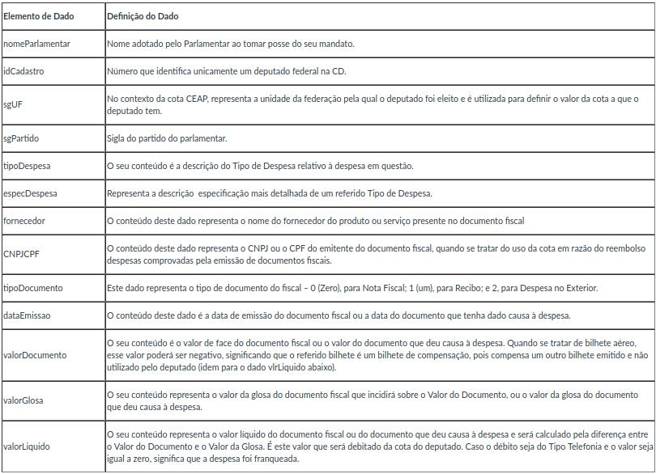

<style>
body {
text-align: justify}
</style>

# Análise de Gastos de Deputados

```{r setup, echo=FALSE, warning=FALSE, message=FALSE}
library(tidyverse)
library(gridExtra)
```


```{r}
dados <- readr::read_csv('dadosCEAP.csv')

limiteMensal <- readr::read_csv('limiteMensalCEAP.csv')

dados %>% full_join(limiteMensal, by = c('sgUF' = 'UF')) -> dados
options(scipen = 999)
```

## Breve descrição das informações disponíveis


## Primeira questão

### Quais são os deputados que gastaram mais dinheiro da CEAP? Quais são os mais econômicos?

Podemos observar como mostrado nos gráficos, o enorme contraste entre os deputados que mais gastaram dinheiro da CEAP e os que menos gastaram. Os deputados que mais gastaram foram Edio Lopes, Rocha Abel Mesquita Jr., Alan Rick e Jhonatan de Jesus. Já os que menos gastaram foram Renam filho, Marcelo Almeida, Marcio Monteiro, Eliseu Padilha e Camilo Cola.

```{r}
# obtem os 5 depudatos que mais gastaram dinheiro da CEAP
maisGastadores <- dados %>% group_by(nomeParlamentar) %>% 
  filter(valorLíquido > 0) %>%
  summarise(totalDeGastos = sum(valorLíquido)) %>% 
  top_n(5)

# plotagem do gráfico para os mais gastadores
maisGastadores %>% ggplot(aes(x = reorder(nomeParlamentar, totalDeGastos), y=totalDeGastos, fill=nomeParlamentar)) + labs(x='Deputados', y='Gasto total', title='Deputados que gastaram mais dinheiro da CEAP') + geom_col(width = 0.7) + coord_flip() + guides(fill = guide_legend('Deputados'))
```

```{r}
# obtém os 5 depudatos que menos gastaram dinheiro da CEAP
menosGastadores <- dados %>% group_by(nomeParlamentar) %>% 
  filter(valorLíquido > 0) %>%
  summarise(totalDeGastos = sum(valorLíquido)) %>% 
  top_n(-5)

# plotagem do gráfico para os mais gastadores
menosGastadores %>% ggplot(aes(x = reorder(nomeParlamentar, totalDeGastos), y = totalDeGastos, fill=nomeParlamentar)) + labs(x='Deputados', y='Gasto total', title='Deputados que gastaram menos dinheiro da CEAP') + geom_col(width = 0.7) + coord_flip() + guides(fill = guide_legend('Deputados'))
```

## Segunda questão

### Quais os estados cujos deputados gastam mais no exterior? Quais os estados cujos deputados gastam menos no exterior? 

Abaixo, temos um gráfico que mostra os cinco estados onde os deputados mais gastam no exterior, e os outros cinco onde se gastam menos. Aqui também vemos uma diferença colossal entre os estados, onde São Paulo por exemplo gastou mais que 100 mil, enquanto que no Maranhão basicamente não teve gastos no exterior.

```{r}
# obtém os 5 estados onde deputados que mais gastaram no exterior
maisGastadoresNoExterior <- dados %>% group_by(sgUF) %>% 
  filter(tipoDocumento == 2) %>%
  summarise(totalDeGastos = sum(valorLíquido)) %>% 
  top_n(5)

# obtém os 5 estados onde deputados que menos gastaram no exterior
menosGastadoresNoExterior <- dados %>% group_by(sgUF) %>% 
  filter(tipoDocumento == 2) %>%
  summarise(totalDeGastos = sum(valorLíquido)) %>% 
  top_n(-5)

# uniao dos gastos para comparar na mesma escala
gastosNoExterior <- union(maisGastadoresNoExterior, menosGastadoresNoExterior)

# plotagem do gráfico para os estados 
gastosNoExterior %>% ggplot(aes(x = reorder(sgUF, totalDeGastos), y=totalDeGastos, fill=sgUF)) + labs(x='Estados', y='Gasto total', title = 'Estados vs Gastos no exterior') + geom_col(width = 0.7) + coord_flip() + guides(fill = guide_legend('Estados'))
```


## Terceira questão

### Quais os partidos cujos parlamentares mais usam CEAP no estado da Paraíba? Quais são os que menos usam? Mesmas perguntas considerando valores em R$.

Podemos analizar através dos gráficos que os partidos que tiveram o maior gasto com a CEAP não são necessariamente equivalentes aos partidos que mais usaram a CEAP, ou seja, temos partidos que usaram várias vezes a CEAP (PP) e gastaram menos da cota do que partidos que usaram um número de vezes menor (PSD).

```{r}
gastosPartidoPB <- dados %>% 
  filter(sgUF == "PB") %>%
  group_by(nomeParlamentar, idCadastro) %>%
  summarise(totalParlamentar = sum(valorLíquido), sgPartido=first(sgPartido), count = n()) %>%
  group_by(sgPartido) %>%
  summarise(total = median(totalParlamentar), count = median(count)) %>%
  arrange(total)

graficoQuantidadeDeGastos <- gastosPartidoPB %>% 
  arrange(count) %>% 
  ggplot(aes(x=reorder(sgPartido, count), y=count, fill=sgPartido)) + 
  geom_col(width = 0.7, show.legend = FALSE) + 
  coord_flip() + labs(x="Partido", y="Quandidade de gastos", title = 'Partidos cujos parlamentares mais usam CEAP no estado da Paraíba')

graficoQuantidadeTotal <- gastosPartidoPB %>% 
  ggplot(aes(x=reorder(sgPartido, total), y=total, fill=sgPartido)) + 
  geom_col(width = 0.7, show.legend = FALSE) + 
  coord_flip() + labs(x="Partido", y="Gasto total")

grid.arrange(graficoQuantidadeDeGastos, graficoQuantidadeTotal, nrow = 2)
```

## Quarta questão

### Quais os deputados que mais ultrapassam o limite de CEAP do seu estado?

Podemos analizar essa questão de duas formas diferentes, a primeira é verificar a quantidade de vezes que um determinado deputado extrapolou o limite de CEAP do estado (primeiro gráfico), como também quem ultrapassou em termos de quantidade de dinheiro gasta (segundo gráfico). Como podemos observar, temos resultados totalmente diferentes em relação as duas verificações em questão. Ao refinar os dados, interessantemente vemos que os deputados que ultrapassaram o limite mais vezes gastaram menos da cota do que os deputados que ultrapassaram menos.

```{r}
# obtendo dados baseado nos deputados que ultaprassaram o limite mensal do seu estado
dadosFiltrados <- dados %>%
  mutate(mes = format(dataEmissao , "%m"), ano = format(dataEmissao , "%y")) %>% 
  group_by(nomeParlamentar, mes, ano, idCadastro) %>% 
  summarise(totalGasto = sum(valorLíquido), limiteMensal = first(limite_mensal)) %>% 
  filter(totalGasto > limiteMensal)

# agrupando dados por deputados
# dado que o deputado pode ter ultrapassado o limite mensal em vários meses
# usamos a mediana pois não é afetada pelos valores extremos do overbudget
dadosAgrupadosPorParlamentar <- dadosFiltrados %>% 
  mutate(overbudget = totalGasto - limiteMensal) %>% 
  group_by(nomeParlamentar, idCadastro) %>% 
  summarise(overbudget = median(overbudget), quantidadesExtrapoladas = n()) %>% 
  ungroup()

dadosOrdenadosPorQuantidadesExtrapoladas <- dadosAgrupadosPorParlamentar %>% 
  arrange(-quantidadesExtrapoladas) %>% 
  slice(1:10)

dadosOrdenadosPorQuantidadesExtrapoladas %>% 
  ggplot(aes(x = reorder(nomeParlamentar, quantidadesExtrapoladas), 
             y = quantidadesExtrapoladas, fill = nomeParlamentar)) + 
  labs(x='Deputados', y='Quantidade extrapolada', title = 'Deputados vs Número de extrapolações do limite da CEAP') + 
  geom_col(width = 0.7, show.legend = FALSE) + 
  coord_flip()
```

```{r}
dadosOrdenadosPorMaiorGasto <- dadosAgrupadosPorParlamentar %>% 
  arrange(-overbudget) %>% 
  slice(1:10)

dadosOrdenadosPorMaiorGasto %>% 
  ggplot(aes(x = reorder(nomeParlamentar, overbudget), 
             y = overbudget, fill = nomeParlamentar)) + 
  labs(x='Deputados', y='Overbudget', title = 'Deputados vs Extrapolações em Real do limite da CEAP') + 
  geom_col(width = 0.7, show.legend = FALSE) + 
  coord_flip()
```

## Quinta questão

### Quais estados cujos parlamentares gastam mais com passagens aéreas?

Como mostrado pelo gráfico abaixo, os TOP 5 estados que mais gastam com passagens aéreas são SP, AM, RJ, MG e BA respectivamente. Provavelmente os parlamentares nesses estados necessitam de viajar muito mais do que em outros estados, ou provavelmente algums deles gastam o dinheiro público com passagens aéreas caras para passeios.

```{r}
# estados onde os deputados mais gastam com passagens aéreas
estadosMaiorGasto <- dados %>% group_by(sgUF) %>%
  filter(tipoDespesa == 'PASSAGENS AÉREAS') %>%
  summarise(totalGasto = sum(valorLíquido)) %>% 
  na.omit()

# plotagem do grafico para os estados
estadosMaiorGasto %>% ggplot(aes(x = reorder(sgUF, totalGasto), y = totalGasto, fill = sgUF)) +
  labs(x='Estados', y='Total Gasto', title = 'Estados vs Gastos com passagens aéreas') + 
  geom_col(width = 0.7, show.legend = FALSE) + 
  coord_flip()
```

## Sexta questão

### Escolha três partidos e responda: Quais são os tipos de despesa mais utilizados no uso da CEAP pelos deputados desses partidos? Mesma pergunta considerando valores em R$.

Baseando-se nos partidos PT, PSOL e PMDB, a tipo de despesa mais ultilizado foi a Emissão de Bilhete Aéreo, que consequentemente é também a dispesa que trás mais gastos. No entanto, o gasto com dispesas como a compra de combustíveis e lubrificantes é menor mesmo sendo usado frequentemente. Do segundo gráfico, podemos observar que curiosamente a atividade de Divulgação da Atividade Parlamentar está entre os principais focos desses partidos e é onde se gasta uma boa quantidade de dinheiro. <br/>
Esses partidos deveriam mesmo investir tanto para promover divulgação e comprar passagens aéreas? Talvez seja por isso que muitos extrapolam absurdamente o limite da CEAP, pois falta recurso para gastar com as demais coisas.

```{r}
# filtragem dos 3 partidos 
partidos <- dados %>% filter(sgPartido %in% c('PT', 'PSOL', 'PMDB'))

# agrupando despesas pelo seu tipo
despesas <- partidos %>% group_by(tipoDespesa) %>% 
  summarise(gastoTotal = sum(valorLíquido), quantidadeUsada = n())

despesasOrdenadasPorUso <- despesas %>% arrange(-quantidadeUsada)

despesasOrdenadasPorUso %>% ggplot(aes(x=reorder(tipoDespesa, quantidadeUsada), y = quantidadeUsada, fill = tipoDespesa)) + labs(x='Tipo Despesa', y='Vezes Usado', title = 'Número de gastos por despesa') + geom_col(width = 0.7, show.legend = FALSE) + coord_flip()
```
```{r}
despesasOrdenadasPorGasto <- despesas %>% arrange(-gastoTotal)

despesasOrdenadasPorGasto %>% ggplot(aes(x=reorder(tipoDespesa, gastoTotal), y = gastoTotal, fill = tipoDespesa)) + labs(x='Tipo Despesa', y='Total Gasto', title = 'Gastos por despesa') + geom_col(width = 0.7, show.legend = FALSE) + coord_flip()
```