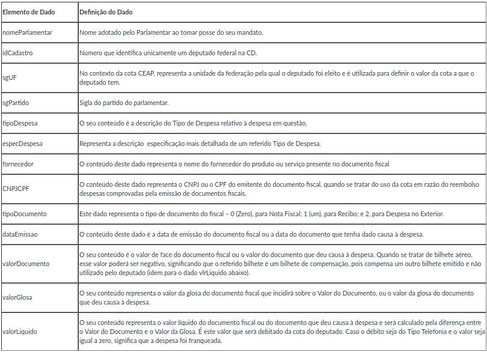

<style>
body {
text-align: justify}
</style>

# Breve Análise de Gastos dos Deputados

```{r setup, echo=FALSE, warning=FALSE, message=FALSE}
library(tidyverse)
library(gridExtra)
```

```{r echo=FALSE, warning=FALSE, message=FALSE}
dados <- readr::read_csv('dadosCEAP.csv')

limiteMensal <- readr::read_csv('limiteMensalCEAP.csv')

dados %>% full_join(limiteMensal, by = c('sgUF' = 'UF')) -> dados
options(scipen = 999)
```

## Descrição dos dados disponíveis


## Primeira questão

### Quais os 5 tipos de despesas mais usados pelos deputados no estado da Paraíba? As 5 despesas mais usadas foram também as que mais custaram?

Como podemos observar, a despesa mais usada pelos parlamentares no estado da Paraíba, foi a **Emissão de Bilhetes Aéreos**, no entando, o que chama mais atenção é que a despesa de **Divulgação da Atividade Parlamentar** mesmo sendo a menos usada em relação as outras quatro despesas, foi nela que os deputados mais gastaram dinheiro. Fica claro que a publicidade da atividade parlamentar é importante para o exercício do mandato, porém o que parece absurdo são os valores.

```{r message=FALSE}
# filtrando os dados das despesas no estado da Paraíba
gastosPartidoPB <- dados %>% 
  filter(sgUF == "PB") %>%
  group_by(tipoDespesa) %>%
  summarise(gastoTotal = sum(valorLíquido), count = n()) %>% 
  top_n(5)

# gráfico de uso das despesas
graficoUsoPorDespesa <- gastosPartidoPB %>% 
  ggplot(aes(x=reorder(tipoDespesa, count), y=count, fill=tipoDespesa)) + 
  geom_col(width = 0.7, show.legend = FALSE) + 
  coord_flip() + labs(x="Tipo de despesa", y="Usos da despesa", title = 'Despesas mais usadas na PB')

# grafico de gasto em dinheiro das despesas
graficoGastoPorDespesa <- gastosPartidoPB %>% 
  ggplot(aes(x=reorder(tipoDespesa, gastoTotal), y=gastoTotal, fill=tipoDespesa)) + 
  geom_col(width = 0.7, show.legend = FALSE) + 
  coord_flip() + labs(x="Tipo de despesa", y="Gasto com despesa", title = 'Gastos com despesas na PB')

grid.arrange(graficoUsoPorDespesa, graficoGastoPorDespesa, nrow = 2)
```


## Segunda questão

### Quais os fornecedores que mais fornecem seus serviços para os deputados? 

Abaixo temos o gráfico dos fornecedores que mais fornecem servições aos deputados. Como podemos ver, as empresas aéreas estão no topo (TAM, GOL, AVIANCA e AZUL), o que faz sentido já que a quantidade de despesas com bilhetes aéreos são enormes. Aqui cabe o questionamento, será que é de fato necessário um gasto tão exorbitante do dinheiro público com passagens aéreas pelos deputados?

```{r}
# coletando dados dos 10 maiores fornecedores 
fornecedores <- dados %>% 
  group_by(fornecedor) %>% 
  summarise(count = n()) %>% 
  arrange(-count) %>% 
  slice(1:10)

# plotagem do grafico para os fornecedores
fornecedores %>% 
  ggplot(aes(x=reorder(fornecedor, count), y=count, fill=fornecedor)) + 
  geom_col(width = 0.7, show.legend = FALSE) + 
  coord_flip() + labs(x="Fornecedor", y="Quantidade de fornecimento", title = 'Maiores fornecedores')
```